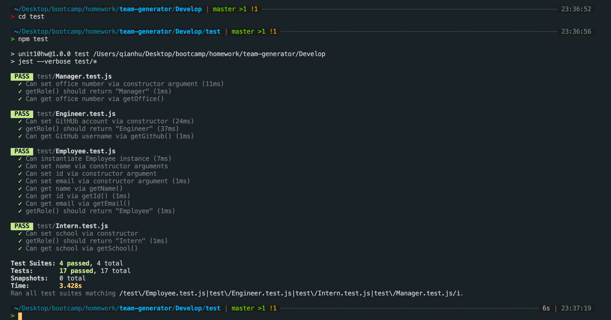
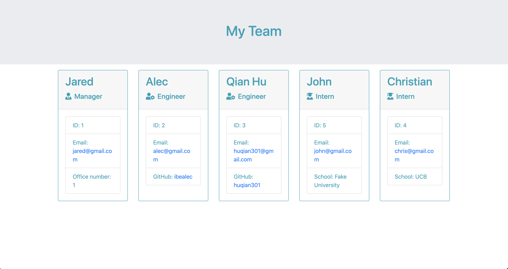

# Unit 10 OOP Homework: Template Engine - Employee Summary

## Description: 
I build a software engineering team generator comman line application. The application will prompt the user for information about the team manager and then information about the team members. The user can input any number of team members, and they may be a mix of engineers and interns. When the user has completed building the team, the application will create an HTML file that displays a nicely formatted team roster based on the information provided by the user. 

## Github links
https://github.com/huqian301/Template-Engine<br>
https://huqian301.github.io/Template-Engine//Develop/output/team.html

## Output 
Here is the [Video](https://drive.google.com/drive/folders/1nF0Fjx1hyNpdeGy_t23cy0_BggAMuxqL?usp=sharing) that shows all the processes.<br>
And here is the test output by using ```npm test```.
<br>
The final page will be look like as below image.



